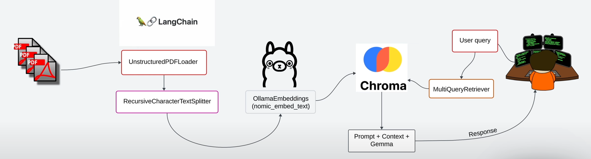

# PDF ingestion with OLLAMA using RAGs 🚀
Creating a local RAG (Retrieval Augmented Generation) pipeline that processes and allows to chat with PDF file(s) using Ollama and LangChain



This project implements a **Retrieval-Augmented Generation (RAG)** pipeline for interacting with local PDF documents. Using streamit, there is a simple UI allowing to uload your own PDF documents and interact with them.
The process follows the steps shown in the diagram below:

1. **Loading PDFs**: The system begins by loading PDF files, which could be documents like reports, notes, or any other textual content. This allows the system to work with documents it hasn't seen before.

2. **Splitting the Content**: After the content is extracted, it's divided into smaller sections or chunks to make it easier to process and retrieve relevant information from later.

3. **Embedding the Text**: Each chunk is converted into vector representations, which capture the meaning of the text in a way that the machine can understand and compare.

4. **Storing the Vectors**: These vector representations are then stored in a database, making it easy to search and retrieve sections of the document that are most relevant to user queries.

5. **User Querying**: When a user asks a question, the system generates several different versions of that query to improve the chances of retrieving the most relevant parts of the document.

6. **Generating a Response**: Finally, the system takes the retrieved sections and uses them to generate a detailed response based on the user's question.


If you have any questions or suggestions, please feel free to create an issue in this repository; I will do my best to respond. 😊

## Running the Streamlit application

1. **Clone repo**: Run this in your terminal 

      ```bash
      git clone https://github.com/stefisha/PDF-ingestion-with-OLLAMA.git
      ```

2. **Install Dependencies**: Execute to install dependencies
  
      ```bash
      pip install -r requirements.txt
      ```

3. **Launch the App**: Run to start the Streamlit interface on `localhost`

      ```bash
      streamlit run streamlit_app.py
      ``` 
