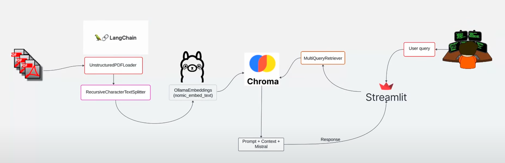

# PDF-ingestion-with-OLLAMA 🚀
Creating a local RAG (Retrieval Augmented Generation) pipeline that processes and allows to chat with PDF file(s) using Ollama and LangChain



If you have any questions or suggestions, please feel free to create an issue in this repository; I will do my best to respond. 😊

## Running the Streamlit application

1. **Clone repo**: Run this in your terminal 

      ```bash
      git clone https://github.com/stefisha/PDF-ingestion-with-OLLAMA.git
      ```

2. **Install Dependencies**: Execute to install dependencies
  
      ```bash
      pip install -r requirements.txt
      ```

3. **Launch the App**: Run to start the Streamlit interface on `localhost`

      ```bash
      streamlit run streamlit_app.py
      ``` 
